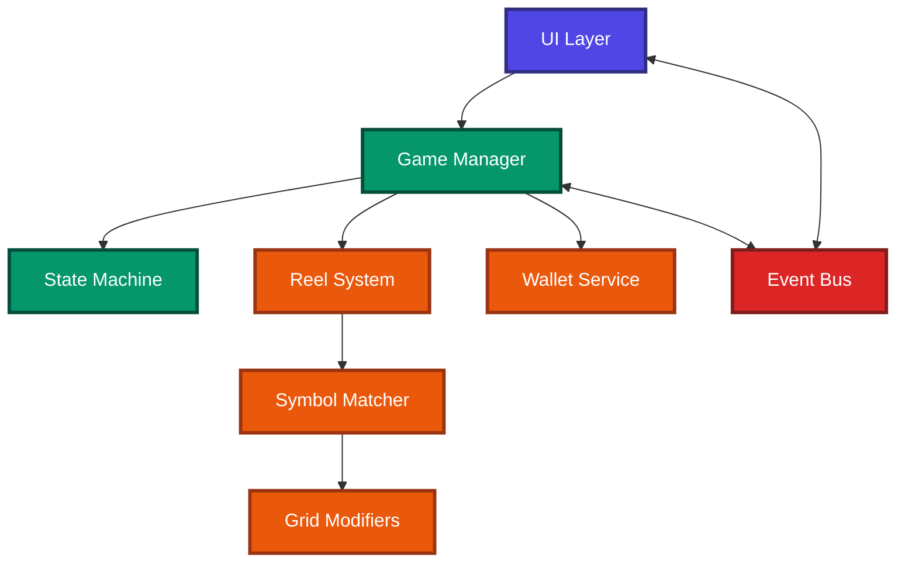
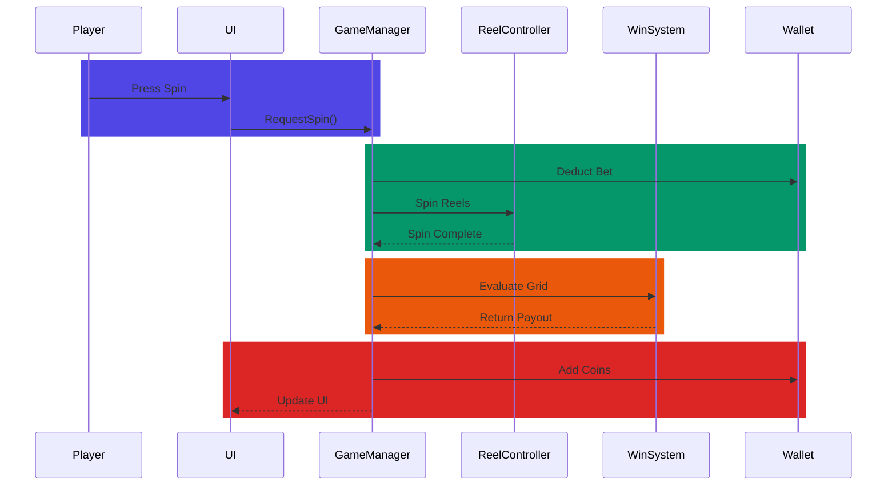

# 🎰 Unity Slot Machine Game

A modular 2D Slot Machine game developed in Unity with a strong focus on scalable gameplay architecture, reusable systems, and clean code practices.

---

# 🎥 Gameplay Demo

  

# 🚀 Features

* Reel spinning system
* RNG-based weighted symbol generation
* Payline evaluation system
* Wild symbol support
* Expanding Wild mechanic
* Event-driven architecture using Event Bus
* Finite State Machine (FSM) based game flow
* ScriptableObject-driven configuration
* Win animations and audio feedback

---

# 🧠 Architecture Overview

This project focuses heavily on gameplay systems architecture and maintainable Unity development practices.

## System Architecture

---

## Spin Flow

---

# 🧩 Architecture Highlights

## ✅ Modular Reel System

Reel logic was separated into dedicated systems:

* Reel Generator
* Reel Spinner
* Reel Stopper
* Reel Symbol Tracker

## ✅ Interface-Based Design

Interfaces were used extensively to decouple gameplay systems and improve scalability.

### Examples

* `IReel`
* `IReelSpinner`
* `IReelStopper`
* `IReelGenerator`
* `IReelSymbolTracker`
* `IPaylineService`
* `IGridModifier`

## ✅ Modifier-Based Gameplay System

Implemented a modifier-driven gameplay architecture where grid data can be modified independently from rendering logic.

This architecture supports future mechanics such as:

* Sticky Wilds
* Cascading Symbols
* Multipliers
* Free Spins

## ✅ Event-Driven Architecture

A custom Event Bus was implemented to reduce tight coupling between systems and improve maintainability.

## ✅ FSM-Based Game Flow

Game flow is managed using a Finite State Machine:

* Idle State
* Spin State
* Result State
* Win State

---

# 🛠️ Built With

* Unity
* C#
* ScriptableObjects
* FSM Architecture
* Event Bus Pattern

---

# 🎯 Focus Areas

* Gameplay Systems Programming
* Clean Architecture
* Scalable Unity Systems
* Modular Design
* SOLID Principles
